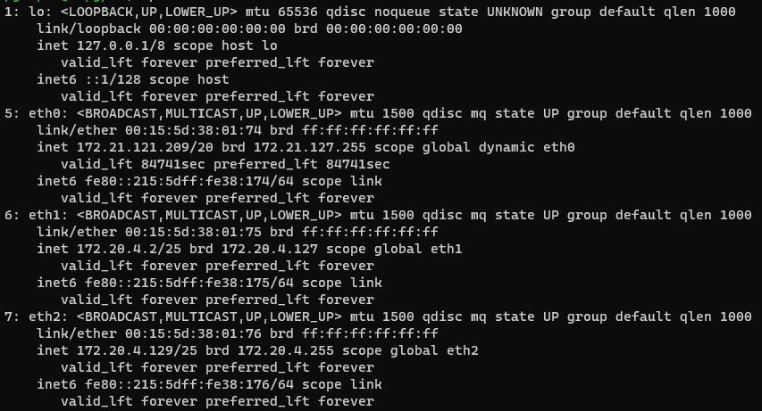
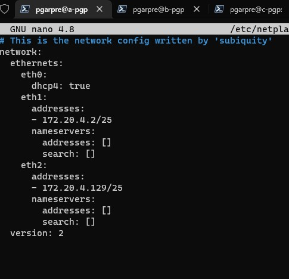
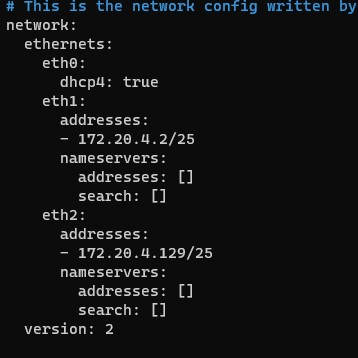
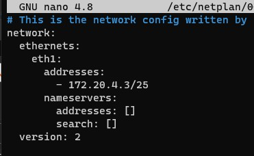
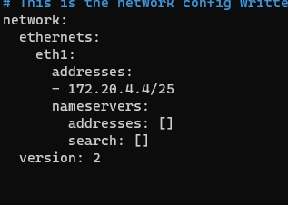
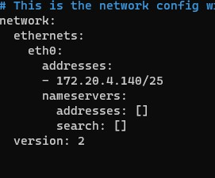
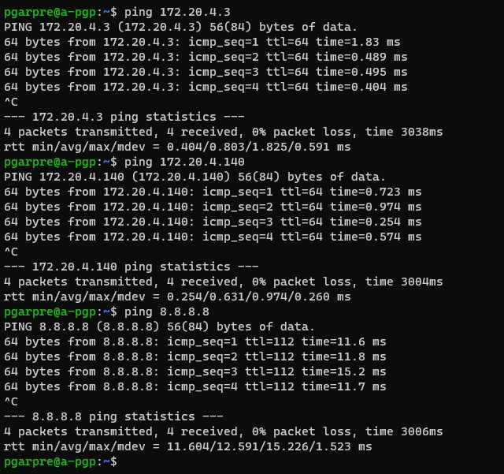
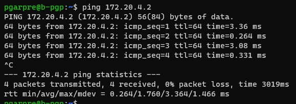
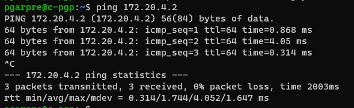
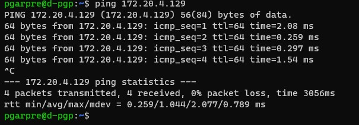

# Práctica PR1101. Configuración de red en Linux

En esta práctica debes indicar el comando que introducirías en Bash para realizar lo que se pide en cada uno de los puntos. Debes introducir la respuesta en el espacio reservado para código después de cada punto.

Para descargar este archivo en formato `md` hazlo desde la url `https://vgonzalez165.github.io/apuntes_iso/UT11_Linux_Instalacion/11_pr1101.md`


## Ejercicio 1. Configuración básica de red

Para ese ejercicio necesitas una máquina virtual con Ubuntu Server y 2 adaptadores de red, el primero en modo puente y el segundo en modo NAT.

Para el adaptador en modo puente utilizarás una IP de la red 172.30.0.0/16 mientras que el adaptador en modo NAT tendrá configurada una IP dinámica.

**Entrega**:
(Todo esto lo hice después del 2 y del 3)
1. Resultado de ejecutar el comando `ip address show`

```
pgarpre@a-pgp:~$ ip address show

```


2. Captura de los ficheros de configuración de `netplan`



3. Captura de la salida del comando ping a 2 compañeros (que tienen su adaptador en modo puente en la misma red que tú), así como a una dirección de Internet (p.e. Google.es)

```
HYPER-V NO TIENE MODO PUENTE :O
```

## Ejercicio 2: Múltiples redes

Vamos a hacer ahora un ejercicio algo más complicado en el que se configuraremos varios equipos en diferentes redes.

Vas a necesitar 4 máquinas virtuales con Ubuntu Server, por lo que el primer paso será realizar tres clonaciones de la máquina que instalamos el primer día. Como probablemente estás utilizando Hyper-V no tendrás problema ya que, al clonar una máquina, le asigna una nueva dirección MAC. Si usaras algún otro hipervisor asegúrate de que las máquinas tengas diferentes direcciones MAC.

**1.- Cambiar los nombres de equipos**

Lo primero de todo, vamos a cambiar los nombres de equipo de todos los servidores, que se identificarán por una letra y tus iniciales. En mi caso serían `a-vjgr`, `b-vjgr`, `c-vjgr` y `d-vjgr`.

Para cambiar el nombre de equipo en Ubuntu Server hay que hacerlo con el comando hostnamectl mediante la siguiente orden:

```
$ sudo hostnamectl set-hostname nuevo_nombre
```

Tras hacerlo, también hay que modificar el fichero `/etc/hosts`, reemplazando el nombre antiguo por el nuevo. No es necesario reiniciar el equipo para que se apliquen estos cambios.

**2.- Configurar un servidor como router**

La otra cosa que necesitarás para esta práctica es configurar un servidor como enrutador. Para ello hay que realizar dos pasos, habilitar el **forwarding** y configurar **iptables** para que reenvíe todos los paquetes que lleguen por un enlace a otro.

Para habilitar el forwarding simplemente debes editar el fichero `/etc/sysctl.conf` y añadir (o descomentar) la línea `net.ipv4.ip_forward=1`. Luego aplicas los cambios ejecutando el comando `sysctl -p`

La configuración de iptables se sale del ámbito de este módulo, así que simplemente limítate a copiar las siguientes líneas en el Shell de Ubuntu.

```
$ sudo iptables -F
$ sudo iptables -t nat -A POSTROUTING --out-interface {interfaz_salida} -j MASQUERADE
$ sudo iptables -A FORWARD --in-interface {interfaz-entrada} -j ACCEPT
```

La estructura de red que queremos representar es la siguiente:


 
Como puedes apreciar, tenemos cuatro servidores, tres con una interfaz de red (que en Hyper  configurarás en modo red interna) y un cuarto servidor que funcionará como enrutador, por lo que tendrá tres interfaces de red: una conectada al *default switch*  para dar salida a Internet y otras dos en modo red interna que se conectarán a las dos subredes que tenemos.

Las IPs de las subredes del ejemplo son orientativas y no son las que tienes que utilizar tú. Tú tienes asignada la red 172.20.X.0/24, donde X es tu número de equipo y tendrás que extraer dos direcciones de subred de dicha red para asignarlas a los equipos.

Entrega: 

1. Debes indicar qué subredes has utilizado, señalando qué IPs has asignado a cada equipo.

```
Subred1: 172.20.4.0/25
Subred2: 172.20.4.128/25

Física: 172.20.4.14/25
        172.20.4.130/25

a-pgp: 172.20.4.2/25
       172.20.4.129/25

b-pgp: 172.20.4.3/25

c-pgp: 172.20.4.4/25

d-pgp: 172.20.4.140/25
```

2. Captura de los ficheros de configuración de netplan de los cuatro equipos.










3. Captura desde los 3 equipos de un ping hacia el enrutador, hacia el otro equipo de la red (solo en el caso de la primera red) y hacia una dirección de internet (por ejemplo, la IP 8.8.8.8)









## Ejercicio 3: Experimentando con la tabla ARP

Ahora vamos a trabajar con la tabla ARP de los equipos de la red anterior. Realiza las siguientes tareas:

1.- Muestra la tabla ARP del equipo A (el que está en una subred con otro equipo). Explica qué indica cada una de las líneas que se muestran.

```
Cada línea es una IP y una MAC de cada uno de los equipos que han enviado algún mensaje a el equipo A, también se muestra por que puerto ha llegado.
```
[Tabla ARP del A](img/arpa.jpg)

2.- Elimina todas las entradas de la tabla ARP del equipo

(En el equipo D)
```
sudo ip -s -s neigh flush all 
```

3.- Añade manualmente la entrada ARP con la IP y MAC del equipo que hace de enrutador (equipo D)

```
sudo arp -s 172.20.4.129 00:15:5d:38:01:76
```

4.- Comprueba que lo has hecho bien haciendo un ping al equipo D

[Ping a-d](img/pingad.jpg)

5.- ¿Cuándo crees que se añadirán automáticamente más entradas a la tabla ARP? Justifica tu respuesta

```
Cuando otros equipos envíen un mensaje a dicho equipo (mediante ping vale)

```

6.- Elimina cualquier entrada de la tabla ARP que no sea la del enrutador. Haz un ping al otro equipo de la red (equipo B). ¿Qué cambios ha habido en la tabla ARP? ¿Por qué?

```
Ninguno, ya que para llegar a esa red tiene que pasar por el enrutador y, debido a ello, no le es necesario guardar dicha mac y dicha ip en la tabla ARP
```

7.- ¿Qué crees que pasaría si introducimos una entrada errónea en la entrada ARP? Por ejemplo, si poner la IP de un equipo y la MAC de otro diferente. Justifica tu respuesta.

```
Que al enviar un paquete no llegará ninguno, ya que en el encabezado de la trama irá la MAC errónea y el equipo destinatario rechazará la trama
```

[Volver](../index.md)