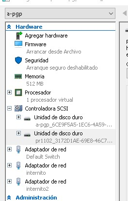
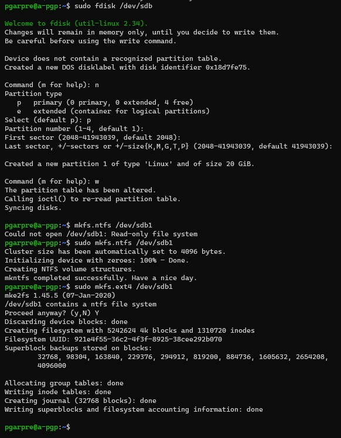
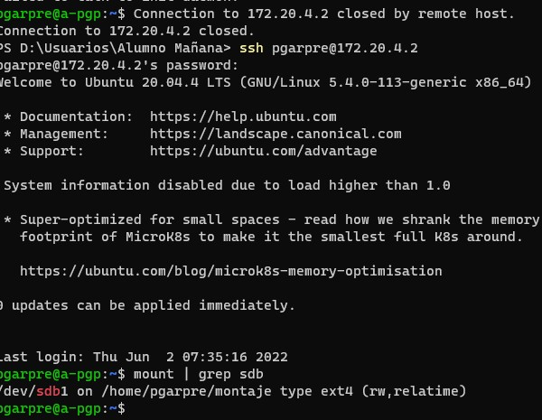

# Práctica PR1102. Usuarios

En esta práctica debes indicar el comando que introducirías en Bash para realizar lo que se pide en cada uno de los puntos. Debes introducir la respuesta en el espacio reservado para código después de cada punto.

Para descargar este archivo en formato `md` hazlo desde la url `https://vgonzalez165.github.io/apuntes_iso/UT11_Linux_Instalacion/13_pr1103.md`


## Ejercicio 1: Permisos

A no ser que se indique lo contrario realiza todas las operaciones desde tu directorio personal.

1.- Crea el directorio `PR0903` dentro de tu directorio personal y dentro de él crea los directorios `dir1` y `dir2` ¿Cuáles son los permisos del directorio `dir1`? Explica quiénes tienen permisos sobre el directorio y qué pueden hacer en él.

```
Solo tiene permisos el usuario que está ligado al directorio personal (en este caso pgarpre) y tiene permisos de lectura, escritura y ejecución, tanto él como el grupo predeterminado al que pertenece. Esto es porque es el admin del sistema.
```

2.- Utilizando   la   **notación   simbólica**, elimina   todos   los   permisos de   escritura (propietario, grupo, otros) del directorio `dir2`.

```
chmod a-w dir2
```

3.-	Utilizando la **notación octal**, elimina el permiso de lectura del directorio `dir2`, al resto de los usuarios.

```
chmod 551 dir2
```

4.- ¿Cuáles son ahora los permisos asociados a `dir2`?

```
dr-xr-x--x
```

5.- Crear bajo `dir2`, un directorio llamado `dir21`.

```
No me deja
```

6.- Concédete a ti mismo permiso de escritura en el directorio `dir2` e intenta de nuevo el paso anterior.

```
chmod 751 dir2
cd dir2
mkdir dir21
```

7.- Dentro de `dir2` crea un fichero en blanco llamado permisos.

```
touch permisos
```

8.- Escribe el comando o comandos que necesitarías para establecer los siguientes permisos en el fichero anterior utilizando notación simbólica. En todos los casos, partimos de que el fichero tiene los permisos `rw-r--r--`

| Permisos      | Notación simbólica                                                             |
| ------------- | ------------------------------------------------------------------------------ |
| `rwxrwxr-x`   | `chmod a+wx permisos | chmod o-w permisos`                                     |     
| `rwxr--r--`   | `chmod u+x permisos`                                                           |     
| `r--r-----`   | `chmod u-w permisos | chmod o-r permisos`                                      |     
| `rwxr-xr-x`   | `chmod a+x permisos`                                                           |     
| `rwxr-xr-x`   | `chmod a+x permisos`                                                           |     
| `r-x--x--x`   | `chmod go-r permisos | chmod u-w permisos | chmod a+x permisos`                |     
| `-w-r----x`   | `chmod uo-r permisos | chmod o+x permisos`                                     |     
| `-----xrwx`   | `chmod o+wx permisos | chmod ug-rw permisos | chmod g+x permisos`              |     
| `r---w---x`   | `chmod go-r permisos|chmod u-w permisos|chmod g+w permisos|chmod o+x permisos` |     
| `-w-------`   | `chmod a-r permisos`                                                           |     
| `rw-r-----`   | `chmod o-r permisos`                                                           |     
| `rwx--x--x`   | `chmod go-r permisos | chmod a+x permisos`                                     |     

9.- Escribe el comando que necesitarías para establecer los siguientes permisos en el fichero anterior utilizando notación octal `rw-r--r--`.

| Permisos      | Notación octal                          |
| ------------- | --------------------------------------- |
| `rwxrwxrwx`   | `chmod 777 permisos`                    |
| `--x--x--x`   | `chmod 111 permisos`                    |
| `r---w---x`   | `chmod 421 permisos`                    |
| `-w-------`   | `chmod 200 permisos`                    |
| `rw-r-----`   | `chmod 640 permisos`                    |
| `rwx--x--x`   | `chmod 711 permisos`                    |
| `rwxr-xr-x`   | `chmod 755 permisos`                    |
| `r-x--x--x`   | `chmod 511 permisos`                    |
| `-w-r----x`   | `chmod 241 permisos`                    |
| `-----xrwx`   | `chmod 017 permisos`                    |


## Ejercicio 2: Moviendo los directorios personales

Vamos a suponer que tenemos un equipo y tras su instalación nos hemos dado cuenta de que nos hemos quedado muy cortos en el espacio asignado a la partición `/home`. Para solucionarlo, hemos optado por añadir otro disco duro al sistema y trasladar al mismo todos los datos del usuario. 

Esta práctica involucra una serie de pasos, que son:

- Añadir un segundo disco duro en Hyper-V
  
- Inicializar el disco, que consiste en:
    - Crear una partición que ocupe todo el espacio del disco
    - Aplicarle formato.
        
    - Para poder acceder al disco crearemos un punto de montaje temporal, por ejemplo, `/mnt/temp`.
    ```
    sudo mkdir /mnt/temp
    sudo mount /dev/sdb1 /mnt/temp
    ```
- Copiamos todo el contenido de `/home` al segundo disco, es decir, a `/mnt/temp`
  ```
    sudo cp -r /home /mnt/temp
  ```
- En este punto tenemos todos los archivos personales duplicados, por un lado, en `/home` (físicamente están en el primer disco duro) y por otro en `/mnt/home` (que físicamente corresponde al segundo disco). Ten en cuenta que también hay archivos ocultos.
- Ahora llega el punto más tedioso, debemos verificar que tanto el propietario como los permisos de los archivos copiados sean idénticos que los de los archivos originales, cambiándolos cuando sea necesario.
  
- Ya es el momento de pasar a utilizar el segundo disco, para ello:
    - Desmontamos el disco de su ubicación temporal.
    ```
    sudo umount /dev/sdb1
    ```
    - Lo montamos temporalmente en `/home`. Ten en cuenta que una vez hecho esto los archivos originales dejarán de ser accesibles (aunque físicamente seguirán en el disco).
    ```
    sudo mount /dev/sdb1 /home
    ``` 
    - Comprobamos que esté todo bien y, si no nos da ningún problema, ya podemos montarlo definitivamente utilizando el fichero de configuración `/etc/fstab`.
    ```
    blkid (UUID de /dev/sdb1 = 921e4f55-36c2-4f3f-8925-38cee292b070)
    sudo nano /etc/fstab
    ``` 
    
    

    [Volver](../index.md)